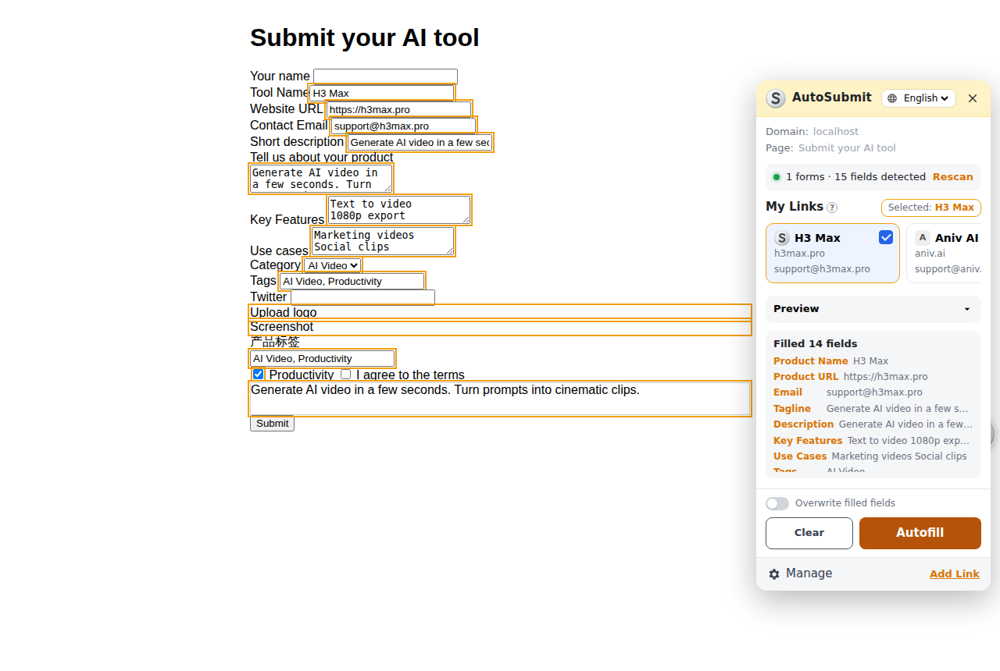
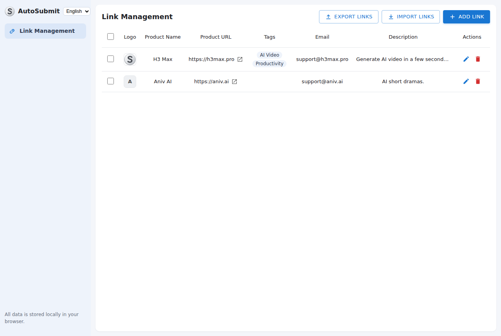

<p align="center"></p>

<h1 align="center">AutoSubmit</h1>

<p align="center">
  Submit your product to AI directories in seconds.<br>
  A Chrome / Edge extension that detects submission forms and autofills them with your product info.<br>
  <b>100% local</b>: no account, no backend, no tracking.
</p>

<p align="center"><a href="#中文说明">中文说明</a></p>

---



## Features

- **Floating launcher**: a silver "S" button docks on the right edge of every page. Drag it up or down; a badge shows how many form fields were detected.
- **Side panel** (300px wide, about ¾ of the screen tall): shows the current domain and page, the form detection status, your products ("My Links"), a preview of the selected one, and the fill result.
- **Smart field matching** uses labels, `aria-*`, placeholders, `name`/`id`, `autocomplete`, and nearby headings, in English and Chinese. It recognizes:
  | Product field | Typical form labels |
  |---|---|
  | Product name | Tool name, Product name, Title, 名称 |
  | Product URL | Website, URL, Link, Homepage, 网址 |
  | Email | Email, Contact email, 邮箱 |
  | Tagline / short description | Short description, Brief description, One-line description, Description (short), Slogan, Summary, 简短描述. An unlabelled field under a "Short description" heading, or a single-line description box capped at 160 characters, also gets the tagline |
  | Description | Description, About, Tell us about…, 描述 |
  | Use cases | Use cases, Scenarios, Who is it for |
  | Key features | Features, Highlights, 功能 |
  | Tags | Tags, Keywords, Category (text, `<select>`, and checkboxes) |
  | Logo | Logo, Icon, Avatar (file upload) |
  | Hero image | Screenshot, Cover, Banner, Image (file upload) |
- **Works with modern sites**: values are set through native setters with `input`/`change` events, so React, Vue, and Angular forms pick them up. Rich-text editors (`contenteditable`) and hidden `<input type="file">` behind drag-and-drop zones are supported. `maxlength` is respected.
- **Safe by default**: it skips personal fields (your name, phone, password), social links, captcha, and consent checkboxes. Fields you already filled stay untouched unless you turn on *Overwrite*. **It never clicks Submit**, so you always review the form before sending.
- **Submission tracking**: mark a directory as submitted per product and see a ✓ on that product's card the next time you visit the site.
- **Link Management page**: add, edit, and delete products, bulk delete, and **Import / Export JSON** (images included) to back up your data or move it to another browser.
- English and 简体中文 UI.



## Install

1. Download the latest `autosubmit-vX.Y.Z.zip` from [**Releases**](https://github.com/junwei000/autosubmit-extension/releases/latest) and unzip it. (Or clone this repository.)
2. Open `chrome://extensions` (or `edge://extensions`) and turn on **Developer mode**.
3. Click **Load unpacked** and select the project folder (the one that contains `manifest.json`).
4. Pin the extension if you like. Clicking the toolbar icon also toggles the panel.

## Usage

1. Click the floating **S** button, then **Manage** (or **Add Link**), and add your product: name, URL, email, tagline, description, use cases, key features, tags, logo, and hero image.
2. Open an AI directory's "Submit your tool" page.
3. Click **S**, pick your product under **My Links**, and click **Autofill**. Filled fields are outlined in orange, and the panel lists what went where.
4. Review the form, finish anything left (captcha, pricing, and so on), and submit.
5. Tick **Mark as submitted** to keep track.

## Privacy

All data lives in `chrome.storage.local` on your machine. The extension makes **no network requests**. Its only permissions are `storage` and `unlimitedStorage` (for the images). The in-page panel runs in an isolated extension iframe and talks to the page script over a private `MessageChannel`. Product data is read directly from extension storage and is never posted to the page's `window`.

## Development

```
manifest.json        MV3 manifest
src/content.js       launcher, panel host, form detection + autofill engine
src/panel.*          side panel UI (iframe)
src/manage.*         Link Management page (options page)
src/store.js         chrome.storage.local helpers
src/i18n.js          en / zh strings
icons/logo.svg       source logo (PNG icons: npm run icons)
test/                Playwright end-to-end test + fixture form
```

No build step: edit the files, then click **Reload** on `chrome://extensions`.

```bash
npm install          # playwright (only needed for tests/icons)
npm test             # loads the unpacked extension in Chromium and autofills test/fixture.html
npm run icons        # re-render icons/*.png from icons/logo.svg
npm run zip          # build dist/autosubmit-v<version>.zip (same as CI)
```

### Releasing

The [Release workflow](.github/workflows/release.yml) builds the zip and publishes a GitHub Release:

1. Bump `"version"` in `manifest.json` and merge to `main`.
2. Push a matching tag (`git tag v1.0.1 && git push origin v1.0.1`), **or** open *Actions → Release → Run workflow* and the tag `v<version>` is created for you.

Found a directory the matcher gets wrong? Open an issue with the site URL, or add its label wording to the rules in `src/content.js` (`RX`) and send a PR.

## License

[MIT](LICENSE)

---

## 中文说明

**AutoSubmit** 是一个浏览器插件，用来把你的产品批量提交到各类 AI 导航站。它会自动识别页面中的表单，把你事先录入的产品信息一键填进去。所有数据都保存在本地浏览器里，没有后端，也不会上传。

### 功能

- 页面右侧边缘吸附一个银白色圆形 **S** 按钮，可以上下拖动，角标显示检测到的表单字段数。
- 点击后在右侧打开宽 300px、约占屏幕 3/4 高的面板：显示当前域名和页面、表单检测结果、我的链接（产品卡片）、字段预览和填充结果。
- 字段识别综合了 label、aria、placeholder、name/id、autocomplete 以及附近的标题文字，中英文都支持。可以识别**产品名称、URL、邮箱、一句话介绍（也匹配 Short Description / 简短描述等字段）、描述、使用场景、核心功能、标签（文本框、下拉框、复选框）、Logo 和主图（文件上传）**。
- 兼容 React、Vue 等框架的表单、富文本编辑器，以及隐藏在拖拽上传区域里的文件上传框，并遵守字段的 maxlength。
- 自动跳过个人姓名、电话、密码、社交链接、验证码和同意条款等字段。默认不覆盖已经填写的内容。**插件不会自动点击提交**，方便你在提交前检查。
- 可以按产品把站点“标记为已提交”，下次访问同一站点时会显示 ✓。
- 管理页（Link Management）支持新增、编辑、删除、批量删除，以及 **JSON 导入 / 导出**（图片也一起导出）。

### 安装

1. 从 [**Releases**](https://github.com/junwei000/autosubmit-extension/releases/latest) 下载最新的 `autosubmit-vX.Y.Z.zip` 并解压（也可以直接 `git clone` 本仓库）。
2. 打开 `chrome://extensions`（Edge 是 `edge://extensions`），开启右上角的**开发者模式**。
3. 点击**加载已解压的扩展程序**，选择包含 `manifest.json` 的项目目录。

### 使用

1. 点击右侧的 **S** 按钮，再点 **管理 / 添加链接**，录入你的产品信息和图片。
2. 打开某个 AI 导航站的提交页面。
3. 点击 **S**，在“我的链接”里选中产品，点 **自动填充**。
4. 检查表单，补全验证码等剩余项后手动提交，再勾选“标记为已提交”。

### 发布新版本

修改 `manifest.json` 里的 `version` 并合并到 `main`，然后推送同名 tag（如 `v1.0.1`），或者在 Actions → Release 里点 **Run workflow**。CI 会自动打包 zip 并发布到 Releases。
